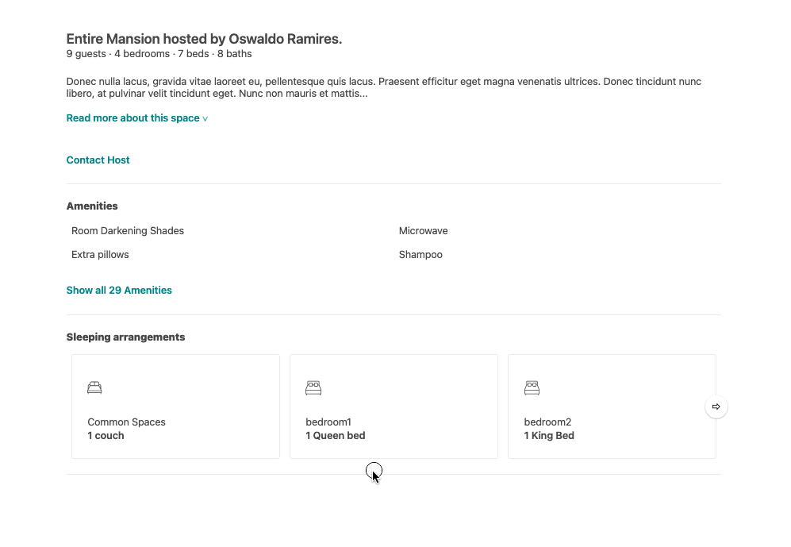

# Project Overnight: descriptions, host, arrangements and settings.

### All the information modules of a popular home sharing website, faithfully recreated.

## Demo



## Project Pages:

  - https://github.com/project-overnight
  - https://github.com/project-overnight/po-photo-banner
  - https://github.com/project-overnight/po-reservations
  - https://github.com/project-overnight/po-reviews

## Table of Contents

1. [Usage](#Usage)
1. [Requirements](#requirements)
1. [Development](#development)

## Usage

**Curently the the
From within the files directory
- To seed the DB, run `npm run seed`
- To start nodemon  run `npm run node-dev`
- To start webpack and have it watch for changes rung `npm react-dev`
- To start `npm run test`
- api end point is localhost:9006/api/description/:id

## Requirements

An `nvmrc` file is included if using [nvm](https://github.com/creationix/nvm).

- Node 12.16.2
- mongo 4.2.5

## Development

⭐️ This project uses airbnb's(!) style guide.

### Installing Dependencies

From within the root directory:

```sh
npm ci
```
